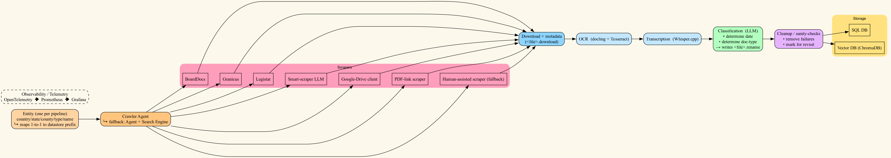

This dataset is licensed under the Creative Commons Attribution-NonCommercial 4.0 International License (CC BY-NC 4.0).
You are free to use this data for academic, research, or journalistic purposes, with attribution. Commercial use is not permitted.

````markdown
# West Virginia K-12 Board-Meeting Document Corpus

**Academic / public-interest release · School Year 2024-2025**

- Please cite this corpus if you use it (see Citation below).
- If you need more than raw data, Noosphere Analytics offers AI-assisted  
  tools for building targeted datasets and uncovering insights.  
  Demo links and contact info are at the end of this file.

```bibtex
@dataset{m_foster_2025_wv_board_corpus,
  author = {Morgan Foster},
  title  = {West Virginia K-12 School-Board Meeting Document Corpus (SY 2024-2025)},
  year   = {2025},
  url    = {https://github.com/noosphereanalytics/WV_2024_2025},
  note   = {Version 1.0.  Please cite if used.}
}
````

---

## 1 · Overview

This archive contains the most complete public collection (to date) of
board-meeting material published by all 55 regular school districts in
West Virginia during the 2024-2025 school year.

Documents were gathered by an automated pipeline that

* crawls district websites,
* scrapes agendas, minutes, contracts, transcripts, etc.,
* classifies each file (date + type),
* applies sanity-checks,
* stores structured metadata in two SQLite databases.

Raw artefacts (PDFs, TXT conversions, etc.) are available via a separate
download link (see Raw Archives).

| Item                    |     Count |
| ----------------------- | --------: |
| Districts covered       |    **55** |
| Files discovered        |   ≈ 9 100 |
| Files represented in DB | **8 100** |
| Download-metadata rows  |     9 094 |

---

## 2 · Folder layout

```
/.
├─ wv_2024_2025.db.gz                     ← main dataset
├─ wv_2024_2025_download_metadata.db.gz   ← download metadata
├─ data.tree.txt                          ← a tree view of the raw data archive 
├─ queries                                ← copy-paste examples

Run `gunzip wv_2024_2025.db.gz wv_2024_2025_download_metadata.db.gz` in order to decompress the sqlite files before using them.

```

### 2.1 Database schema & File Format Guide


### `entities` Table

Represents each public body (e.g., a school district).

| Column         | Description                                                |
|----------------|------------------------------------------------------------|
| `entity_id`    | Primary key (internal ID)                                  |
| `name`         | Canonical name (e.g. `jackson_county_schools`)             |
| `entity_type`  | Always `school_boards` for this corpus                     |
| `country`      | Country (e.g. `"usa"`)                                     |
| `state`        | State abbreviation (e.g. `"wv"`)                           |
| `county`       | County name in lowercase/underscored form (e.g. `"jackson"`) |
| `url`          | Public-facing website for the entity (optional)           |
| `address`      | Mailing or contact address (if available)                 |

Unique constraint ensures no duplicate entities:  
`(name, country, state, county, entity_type)`

---

### `meeting_documents` Table

Represents individual meeting documents (e.g., minutes, contracts, agendas).

| Column               | Description                                                                 |
|----------------------|-----------------------------------------------------------------------------|
| `meeting_document_id`| Primary key                                                                |
| `entity_id`          | Foreign key to `entities`                                                  |
| `date`               | Document's associated meeting or publication date                          |
| `doctype`            | Labeled document type (e.g. `MINUTES`, `CONTRACT`, `TRANSCRIPT`, etc.)     |
| `filename`           | Canonical filename of the processed file                                   |
| `source_url`         | Original public link to the file (if available)                            |
| `text`               | Extracted full text (if applicable)                                        |
| `raw_filename`       | Name of the original file downloaded                                       |
| `raw_md5sum`         | Unique MD5 checksum of raw file                                            |
| `text_md5sum`        | MD5 checksum of extracted text content                                     |
| `is_supplementary`   | Boolean (0/1) — whether this document supplements another                  |
| `parent_document_id` | Optional: if this is a supplement, link to the parent document             |

Uniqueness constraint prevents duplicates per document + entity:  
`(entity_id, date, doctype, filename, text_md5sum, parent_document_id)`

---

### `download_metadata` Table

Tracks download events and provenance for every file acquired by the system.

| Column                 | Description                                                               |
|------------------------|---------------------------------------------------------------------------|
| `download_metadata_id` | Primary key                                                              |
| `meeting_document_id`  | Optional link to the canonical document (null during initial processing) |
| `download_url`         | Direct link to file                                                      |
| `saved_as`             | Filename used when saving locally                                        |
| `source_page`          | Page from which file was extracted (if available)                        |
| `md5`                  | MD5 checksum of downloaded file                                          |
| `downloaded_utc`       | UTC timestamp of download                                                |
| `version`              | Download version number (used for retries/re-runs)                      |
| `module`               | Python module responsible for scraping/downloading                      |

---

### `.download` Files

Each `.download` file is a JSON object capturing metadata about a single file download. Example:

```json
{
  "download_url": "https://go.boarddocs.com/.../Revised%20po4220.pdf",
  "saved_as": "Revised%20po4220.pdf",
  "source_page": null,
  "md5": "b545c5fb3a0339141683594e69c04ab9",
  "downloaded_utc": "2025-06-17T03:19:25Z",
  "version": 0,
  "module": "src.interfaces.cli.board_meetings.scrape.pdf_link_extractor"
}
```

### `.rename` Files

Each .rename file contains a 2-line structure used for LLM classification traceability:

`<fully classified text file path>`
`<classification rationale from the LLM>`

Line 1: Path of the cleaned and labeled .txt file

Line 2: Human-readable reasoning from the language model used for classification

These files provide transparent audit trails for how document types were inferred.

---

## 3 · Example query

Find every document that mentions “executive order” or “tariff”
(case-insensitive) and list the district, date and filename:

```sql
SELECT e.name,
       md.date,
       md.filename,
       md.source_url
FROM   meeting_documents md
JOIN   entities e USING (entity_id)
WHERE  LOWER(md.text) LIKE '%executive order%'
   OR  LOWER(md.text) LIKE '%tariff%'
ORDER  BY md.date;
```

| Entity                        | Date       | Source URL                                                                                                            | Text snippet                                                                                                                            | File (internal ID)                                           |
| ----------------------------- | ---------- | --------------------------------------------------------------------------------------------------------------------- | --------------------------------------------------------------------------------------------------------------------------------------- | ------------------------------------------------------------ |
| **marion\_county\_schools**   | 2022-06-21 | [link](https://core-docs.s3.amazonaws.com/documents/asset/uploaded_file/1972/MCS/2220774/01-070522_Attachment.pdf)    | “…pricing may be affected by market conditions including, but not limited to, **tariffs**, quotas, and/or duties…”                      | `2022-06-21-ec00380a1d4c846da0fc45264700f942-minutes.txt`    |
| **randolph\_county\_schools** | 2022-09-09 | [link](https://go.boarddocs.com/wv/rand/Board.nsf/files/DE9R3S6B3F5B/$file/School%20Specialty%20AEPA%20Contract.pdf)  | “…shall abide by the requirements of **Executive Order** 11246, ‘Equal Employment Opportunity’…”                                        | `2022-09-09-690ef3ab32ddd98c023f464a5ad3ab43-contract.txt`   |
| **mason\_county\_schools**    | 2023-04-01 | [link](https://go.boarddocs.com/wv/mcsd/Board.nsf/files/DGMHM5491BF3/$file/6325.pdf)                                  | “…subject to and shall abide by the non-procurement debarment and suspension regs implementing **Executive Orders** 12549 and 12689…”   | `2023-04-01-99ce7e2e7553bfb8a5c88b0c23b96bf9-other.txt`      |
| **marion\_county\_schools**   | 2023-05-01 | [link](https://core-docs.s3.amazonaws.com/documents/asset/uploaded_file/1972/MCS/3023089/43-051523_ATTACHMENT_A.pdf)  | “…The parties hereto shall abide by the requirements of **Executive Order** 11246, 42 U.S.C. §2000d…”                                   | `2023-05-01-516449ff5e11b9c38aba484be494d08d-minutes.txt`    |
| **kanawha\_county\_schools**  | 2024-01-18 | *(Please refer to download metadata)*                                                                                 | “…and bathrooms. First SCOTUS ruled that in Title VII sex included gender identity. Next Biden’s **Executive Order** transferred the SCOTUS decision to Title IX…” | `2024-01-18-823eaf122756698479c11782a7ad1b88-minutes.txt`    |
| **boone\_county\_schools**    | 2024-03-04 | [link](https://go.boarddocs.com/wv/booneboe/Board.nsf/files/D3AQYM67F25A/$file/SCHOOL%20DATEBOOKS.pdf)                | “…If an item on this contract is impacted by **tariffs**, SOT may impose a surcharge in the amount of the tariff…”                      | `2024-03-04-e7eedd72340cbb7c41b7806473c689bc-contract.txt`   |
| **gilmer\_county\_schools**   | 2024-05-07 | [link](https://go.boarddocs.com/wv/gilmer/Board.nsf/files/D52PMG61E265/$file/Bills%20for%20payment%205%2013%2024.pdf) | “…HOPE GAS tariff for May… TAR IFF for April… TAR IFF for June…”                                                                        | `2024-05-07-1d732866b6da5b12e0a3a758cd9f1150-other.txt`      |
| **kanawha\_county\_schools**  | 2024-11-21 | *(Please refer to download metadata)*                                                                                 | “…why Title VII sex included gender identity. Next Biden’s **executive order**…”                                                        | `2024-11-21-88845ae9f8134f6313b2fe993d5a4f0b-transcript.txt` |
| **berkeley\_county\_schools** | 2025-04-03 | [link](https://youtube.com/live/hScZtpD3E_w)                                                                          | “…we have new **tariffs**. So we do need to be conscientious that with that project…”                                                   | `2025-04-03-04e1288182dee21c6360cd1a1088a388-transcript.txt` |
| **boone\_county\_schools**    | 2025-05-14 | [link](https://go.boarddocs.com/wv/booneboe/Board.nsf/files/DH3Q7Z6784DD/$file/HVAC%20UNIT.MADISON%20ELEMENTARY.pdf)  | “…Any additional taxes, duties, **tariffs** or similar items imposed prior to shipment will be charged…”                                | `2025-05-14-1f791cdfe09c940f9e08e2c784469672-proposal.txt`   |
                                        

---

## 4 · Doctype glossary

| Doctype    | Description                              |
| ---------- | ---------------------------------------- |
| AGENDA     | Board meeting agenda (regular / special) |
| MINUTES    | Official minutes / approved proceedings  |
| MEMO       | Memoranda / staff reports                |
| PROPOSAL   | Bid, budget or policy proposals          |
| CONTRACT   | Awarded contracts / RFPs                 |
| RESOLUTION | Formal board resolutions                 |
| ANCILLARY  | Attachments referenced in meetings       |
| CALENDAR   | School or board calendars                |
| AMENDMENT  | Amended versions of prior docs           |
| TRANSCRIPT | Speech-to-text transcripts (Whisper.cpp) |
| OTHER      | Un-categorised items                     |

---

## 5 · Pipeline at a glance



Each entity (district) is processed in its own pipeline.
Paths mirror geography:

```plaintext
data/countries/usa/states/wv/counties/<county>/<entity_type>/<entity_name>/<year>/
```

---

## 6 · Limitations & known issues

* Inline / popup minutes – some districts embed minutes directly in a webpage; the scraper captured them but metadata was corrupted on this run.
* Model accuracy – classification used gpt-4o-mini. Error-rate is \~25 % higher than gpt-4o, resulting in occasional missing or mislabeled files.
* \~1 000 files failed downstream processing (OCR timeouts, exotic layouts).

> Please report issues via GitHub.
> If you fix something by editing the DB, feel free to open a PR with a .sql
> patch describing your changes.

---

## 7 · Raw archives

These will be added via archive.org and the link added here.
If you need the raw (\~16GB) corpus before then, please email
[morgan@noosphereanalytics.com](mailto:morgan@noosphereanalytics.com)

The tree view of the archive is available [here](data.tree.txt)

---

## 8 · Beyond the corpus — Noosphere Analytics

Noosphere Analytics is more than data collection – we provide a
full suite of AI-assisted tools that help you:

* Build targeted datasets from massive file collections
* Auto-categorise & tag documents for immediate charting
* Discover relationships and hidden patterns

**Live demos**:

* [https://noosphereanalytics.com/demos/MOU/](https://noosphereanalytics.com/demos/MOU/)
* [https://noosphereanalytics.com/demos/gender-identity/](https://noosphereanalytics.com/demos/gender-identity/)
* [https://noosphereanalytics.com/demos/book-discussions/](https://noosphereanalytics.com/demos/book-discussions/)

Interested in a personalised demo?
Email [morgan@noosphereanalytics.com](mailto:morgan@noosphereanalytics.com)

---

## 9 · Contact & feedback

* GitHub Issues: [https://github.com/your\_org/wv-school-board-corpus/issues](https://github.com/your_org/wv-school-board-corpus/issues)
* Email: [morgan@noosphereanalytics.com](mailto:morgan@noosphereanalytics.com)

**Happy researching!**

```

Let me know if you’d like this exported as a `.md` file or need a PDF version as well.
```
